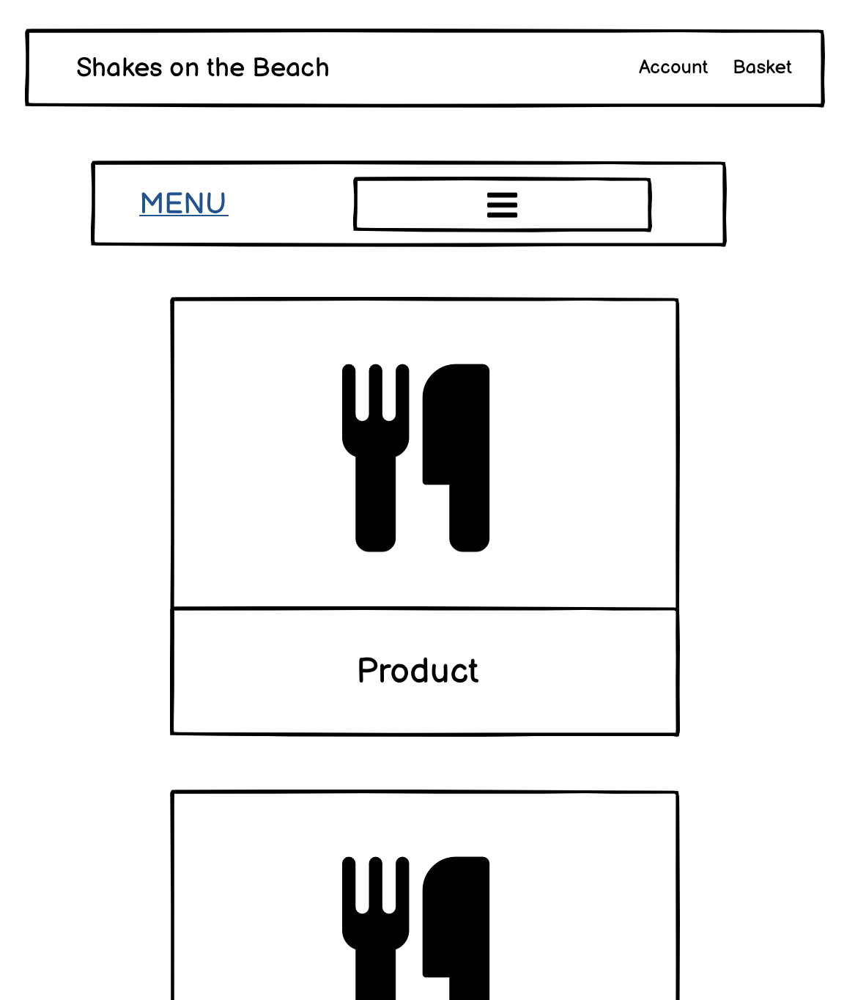
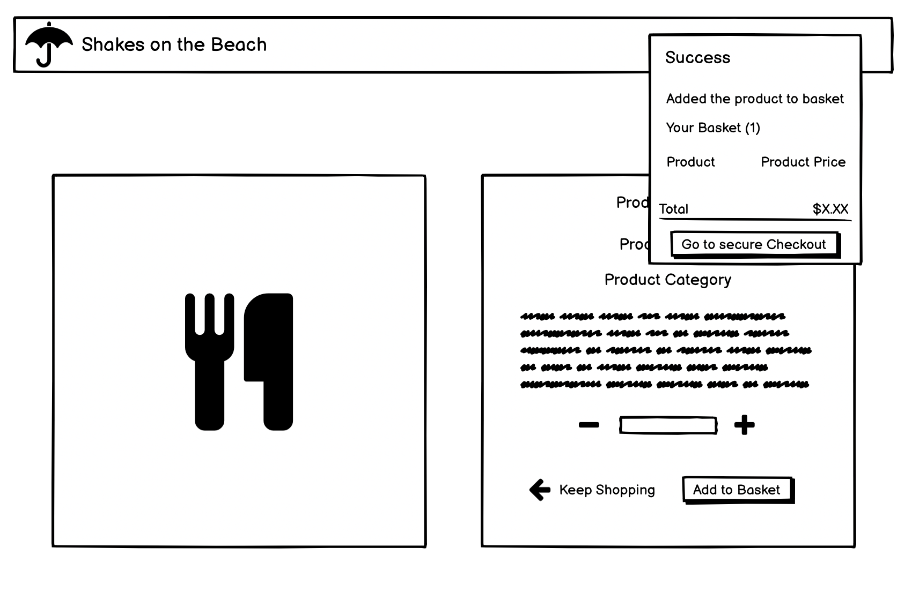

# **Shakes on the Beach**

Live Link - [https://shakes-on-the-beach.herokuapp.com/](https://shakes-on-the-beach.herokuapp.com/)


---

## **Table of Contents**

---

- [Overview](#overview)
- [UX](#ux)
  - [Stories](#stories)
  - [Strategy](#strategy)
  - [Scope](#scope)
  - [Structure](#structure)
  - [Skeleton](#skeleton)
  - [Surface](#surface)
- [Wireframes](#wireframes)
- [Features](#features)
- [Testing](#testing)
  - [Manual](#manual)
  - [Automated](#automated)
  - [Bugs](#bugs)
- [Technologies Used](#technologies-used)
- [Resources](#resources)
- [Project barriers and the solutions](#project-barriers-and-the-solutions)
- [Deployment](#deployment)
- [Credits](#credits)
- [Acknowledgements](#acknowledgements)
- [Support](#support)

---

## **Overview**

---

Shakes on the beach is a seaside cafe offering an assortment of food and drinks.

This web application is designed to allow the user to browse the available products and build a basket. The contents of the basket are then processed into an order which the user can decide is to be collected or delivered to the customer designated address.

---

## **UX**

---

### **Stories**

#### **User Stories**

As a user, I would like to...

- Browse a menu of the available products the cafe offers.
- Select the items I wish to order and add them to a basket.
- Adjust the basket by increasing or decreasing the amount of an item, or remove the item entirely.
- Enter my delivery and credit card information so I can submit my order to be delivered to my chosen address.
- Receive confirmation of my order with the order, billing and delivery details.
- Have the option of creating a user profile to store my information to process my future orders more easily.

#### **Developer Stories**

As a developer, I hope to...

"Build a fully functional e-commerce site that users' will find visually pleasing as well as easy to navigate"

"Emulate a typical users' experience on a website of this type, implement features that are often seen on take away websites."

"Being an aspiring software developer, creating a website that can be easily modified and changed to fit various purposes as needed by future clientele"

### **Strategy**

#### **Project Goals:**

To create a...

- Fully functional e-commerce site
- Friendly and enjoyable experience for the user
- A colourful picturesque site with each page having their own unique design
- Web application using a full-stack framework, building a database and implementing user CRUD functionality to interact with it.

#### **User Goals:**

As a user, I want to be able to...

- Browse a list of products available and build a basket
- Complete an order with the contents of the basket, being able to choose delivery or collection
- Receive an order confirmation with a unique order number and a list of the contents and the details of the order
- Create a user profile to store my order history and my information for easier checkout

---

[Return to Table of Contents](#table-of-contents)

---

### **Scope**

#### **Planned Functionality:**

Navbar:

- Title/Title Icon - Reveal the navigation links to various pages on the site.
  - Home - Navigates the user to the Home page.
  - Menu - Navigates the user to the Menu page.
  - About us - Navigates the user to the About us page.
  - Customer Gallery - Navigates the user to the Gallery page.
- Account
  - If a user is not logged in...
    - Register - Navigate the user to the sign-up page to create a user profile
    - Login - Navigate the user to the login page so the user can login to their user profile
  - If a user is logged in...
    - My Profile - Navigate the user to the sign-up page to create a user profile
    - Logout - Navigate the user to the logout page so the user can confirm they wish to log out
- The basket icon or the total cost of products present in the basket, will navigate the user to the basket page

Home Page:

- Home Page Button - navigated the user to the menu page

Menu Page:

- Menu Navbar
  - Clicking the "MENU" anchor will refresh the menu page showing all products available
  - Nav Items
    - Burgers - will show all burgers available in the store
    - Pizza - will show all pizzas available in the store
    - Sandwich - will show all sandwiches available in the store
    - Salad - will show all salads available in the store
    - Shakes - will show all shakes available in the store
    - Drinks - will show all drinks available in the store
  - Each product will have its own container, where the image can be clicked to bring the user to the product details page of the clicked product
  - The arrow box/icon in the bottom right-hand corner will return the user to the top of the page

Menu Product Details Page:

- Clicking on the product image will open the image in a new tab for better visibility
- A quantity form for a user to alter the value of the quantity to be added to the basket
  - The "+" will increase the value of the quantity by one
  - The "-" will decrease the value of the quantity by one
  - The user can click on the field manually and type the number they wish to add to the basket
- < Keep Shopping - will return the user to the menu page
- Add to Basket - will take the product on the page, and the quantity in the selector, and add that amount of the product into the basket
  - When the product has been added to the basket, the success toast should appear stating that the product was added successfully and showing the current items in the basket, and there is a button to proceed to the basket

Basket Page:

- A quantity form for a user to alter the value of the quantity currently in the basket
  - The "+" will increase the value of the quantity by one
  - The "-" will decrease the value of the quantity by one
  - The user clicks on the field manually and types the number for the quantity they want in the basket
- Update - the basket will be updated with the quantity that is shown in the selector
  - When the quantity has been updated, the success toast should appear stating that the quantity has been updated and showing the current items in the basket, and there is a button to proceed to the basket
- Remove - will show the remove confirmation modal
  - Close - will reload the basket as it was before the modal was shown
  - Remove - the item with which the "Remove" anchor is associated will be removed from the basket
    - When the product has been removed, the success toast should appear stating that the product has been removed and showing the current items in the basket, and there is a button to proceed to the basket
- < Keep Shopping - will return the user to the menu page
- Secure Checkout - will navigate the user to the checkout page with the basket on the current page

Checkout Page:

- Input fields
  - Delivery
    - Full Name - User must enter their name
    - E-mail - User must enter their e-mail
    - Phone Number - User must enter their phone number
    - Street Address 1 - User must enter the first line of their address
    - Street Address 2 - User can enter the second line of their address 
    - Town or City - User must enter their town or city
    - Postal Code - User can enter their postal code
    - County, State or Locality - User can enter their county, state or locality
    - If a user is logged in...
      - A checkbox to indicated you want to save the data in the input fields so the users' profile
    - If a user is not logged in...
      - Create an account - which will navigate the user to the sign-up page
      - Login - which will navigate the user to the login page
    - Payment input field - the user must enter their credit card information to proceed with the order
    - < Adjust Basket - will return the user to the basket page
    - Complete Order - will attempt to process the users' order, if successful will navigate the user to the checkout success page
  - Collection
    - Full Name - User must enter their name
    - E-mail - User must enter their e-mail
    - Phone Number - User must enter their phone number
    - If a user is logged in...
      - A checkbox to indicated you want to save the data in the input fields so the users' profile
    - If a user is not logged in...
      - Create an account - which will navigate the user to the sign-up page
      - Login - which will navigate the user to the login page
    - < Adjust Basket - will return the user to the basket page
    - Complete Order - will attempt to process the users' order, if successful will navigate the user to the checkout success page


Checkout Success Page:

- Here - A link to navigate the user to the Gallery page to upload a picture of their meal
- Order Number - There is a copy icon next to the number, if clicked will copy the order number to the clipboard.
- If coming from the profile page
  - Back to Profile - will navigate the user back to their profile page

About Us Page:

- Footer
  - Contact Information
    - Phone Number - href tel: for the user to call the store by clicking the link
    - E-mail Address - href mailto: for the user to open a blank e-mail in the default mail app with the store set as the recipient 
  - Social Links
    - Facebook - A link that navigates the user to Facebook profile in a new tab
    - Twitter - A link that navigates the user to Twitter profile in a new tab
    - LinkedIn - A link that navigates the user to Linkedin profile in a new tab
    - Instagram - A link that navigates the user to Instagram profile in a new tab
    - Youtube - A link that navigates the user to Youtube profile in a new tab
    - Github - A link that navigates the user to Github profile in a new tab

Gallery:

- A table-based gallery of user-uploaded images, intended to display pictures of the users' meals in the hopes of winning a free meal
- If the user is logged in...
  - Add Image - Navigates the user to the add image page for the user to upload their meal picture
- If the logged-in user is a superuser...
  - Edit - Navigates the user to the edit image page
  - Delete - Reveals the delete confirmation modal
    - Cancel - Reloads the page with the gallery just as it was before you pressed "delete" to reveal the modal
    - Delete - Deletes the image from the Gallery 

Add Image:

- Choose File 
  - Opens your devices file explorer for you to choose and image to be uploaded
- Order Number - The user enters their order number in order to be entered into the free meal competition
- Cancel - Returns the user to the Gallery page with nothing having been added
- Add Image - Submits the form to add the image to the gallery 

Edit Image:

- Choose File 
  - Opens your devices file explorer for you to choose and image to be uploaded
- Order Number - The user enters their order number in order to be entered into the free meal competition
- Cancel - Returns the user to the Gallery page with nothing having been added
- Edit Image - Submits the form to edit the image in the gallery 


Sign-Up Page:

- Sign In - A link to navigate the user to the login if they already have an account set up
- E-Mail - input for users to enter the e-mail they wish to use with their profile
- E-Mail Confirmation - input for user to enter the e-mail again to they have entered the correct address
- Username - input for the user to enter a username to associate with the account or use as an alternative login
- Password - input for the user to enter the password they wish to use to login with
- Password Confirmation - input for the user to enter the password to ensure they have entered the correct password
- Back to Login - A link to navigate the user to the login page if they already have an account set up
- Sign-Up - The submit button for the form to create a user profile with the details provided

Login Page:

- Sign-Up - A link to navigate the user to the sign-up page if they do not have an account set up
- Username or E-Mail - input for user to enter their username or e-mail associated with their profile
- Password - input for the user to enter the password they have associated with their account to login
- Remember Me - a checkbox for user's to tick if they wish their login details to be remembered by the webpage
- Menu - a link to navigate the user to the menu page
- Sign In - The submit button for the form to sign in to their user profile if it exists and the details are correct

Profile Page:

- Default Delivery Information
  - Phone Number - input for user to enter their default order phone number
  - Street Address 1 - input for user to enter their default order street address 1
  - Street Address 2 - input for user to enter their default order street address 2
  - Town or City - input for user to enter their default order town or city
  - Postal Code - input for user to enter their default order postal code
  - County, State or Locality - input for user to enter their default order county, state or locality
- Update Information - A submit button for the form to save the default delivery information to their profile
- Order Number - clicking on any of the order numbers on your order history will navigate the user to a modified version of the checkout success page to review their order

Password Reset Page:

- E-Mail Address - An input to enter the e-mail address for the user to enter the e-mail of the account they want to reset the password for.
- Back to Login - A link to navigate the user to the login page
- Reset the password - a submit button for the form to submit the e-mail address, if the e-mail exists on a profile, the e-mail will receive a password reset e-mail 

Verification Pages:

- E-mail confirmation 
  - After signing up an e-mail will be sent to the profiles e-mail address to confirm and activate the account
  - If the user attempts to sign in without confirming they will be redirected to the verification page again and a second e-mail will be sent

Toasts:

- Success
  - Add Product - when on a menu product details page and press the "add to basket" button, the page will reload with the success toast showing stating the product has been added and showing the current basket contents
  - Quantity Update - when on the basket or menu product details page, and are adding more of the product or updating the quantity in the basket, the page will reload with the success toast showing stating the product quantity has been updated and showing the current basket contents
  - Remove - when you press "remove" on the remove confirmation modal on the basket page, the page will reload and state the image has been removed, as well as show the basket contents if there is any.
  - Order processed - When an order has been successfully processed the success toast will pop up with the order number and the e-mail the order confirmation e-mail has been sent to.
  - Added Image - when you press "add image" on the remove confirmation modal for either the basket or the gallery as a superuser, the page will reload and state the image has been removed, as well as show the basket contents if there is any.
  - Deleted Image - when you press "delete" on the delete confirmation modal on the gallery as a superuser, the page will reload and state the image has been removed, as well as show the basket contents if there is any.
  - Updated profile - When you have filled out the form on the profile page and press the "update information" button, if you wish to save the information to your profile
- Info
  - Editing image - when you press edit on the card body when signed in as a superuser, the edit image page will load and show the info toast stating the order number of the image you are editing.
  - Old order confirmation - when you click the order number of any of the orders in the order history on a profile it will navigate to a modified version of the checkout success page showing the details of the order in question.
- Warning
  - Stripe Key missing - If there is a problem with the stripe key needed to process payments the toast will state the issue
- Error
  - Can't find product - if the product is missing from the database
  - Can't process the payment - if there is an issue with processing a payment
  - Error with the form - if the form has some missing or invalid data
  - Nothing in your basket - if you try to access the checkout page with an empty basket
  - Only Authorized user's - if you try and access a page that is restricted for superuser's

Error Pages:

- 404
  - Back to the Beach - Returns the user to the homepage
- 500
  - Back to the Beach - Returns the user to the homepage

---

[Return to Table of Contents](#table-of-contents)

---

### **Structure**

#### **Interaction Design:**

Navbar:

- Title/Title Icon - Reveal the navigation links to various pages on the site.
  - Home - Navigates the user to the Home page.
  - Menu - Navigates the user to the Menu page.
  - About us - Navigates the user to the About us page.
  - Customer Gallery - Navigates the user to the Gallery page.
- Account
  - If a user is not logged in...
    - Register - Navigate the user to the sign-up page to create a user profile
    - Login - Navigate the user to the login page so the user can login to their user profile
  - If a user is logged in...
    - My Profile - Navigate the user to the sign-up page to create a user profile
    - Logout - Navigate the user to the logout page so the user can confirm they wish to log out
- The basket icon or the total cost of products present in the basket, will navigate the user to the basket page

Home Page:

- Home Page Button - navigated the user to the menu page

Menu Page:

- Menu Navbar
  - Clicking the "MENU" anchor will refresh the menu page showing all products available
  - Nav Items
    - Burgers - will show all burgers available in the store
    - Pizza - will show all pizzas available in the store
    - Sandwich - will show all sandwiches available in the store
    - Salad - will show all salads available in the store
    - Shakes - will show all shakes available in the store
    - Drinks - will show all drinks available in the store
  - Each product will have its own container, where the image can be clicked to bring the user to the product details page of the clicked product
  - The arrow box/icon in the bottom right-hand corner will return the user to the top of the page

Menu Product Details Page:

- Clicking on the product image will open the image in a new tab for better visibility
- A quantity form for a user to alter the value of the quantity to be added to the basket
  - The "+" will increase the value of the quantity by one
  - The "-" will decrease the value of the quantity by one
  - The user can click on the field manually and type the number they wish to add to the basket
- < Keep Shopping - will return the user to the menu page
- Add to Basket - will take the product on the page, and the quantity in the selector, and add that amount of the product into the basket
  - When the product has been added to the basket, the success toast should appear stating that the product was added successfully and showing the current items in the basket, and there is a button to proceed to the basket

Basket Page:

- A quantity form for a user to alter the value of the quantity currently in the basket
  - The "+" will increase the value of the quantity by one
  - The "-" will decrease the value of the quantity by one
  - The user can click on the field manually and types the number for the quantity they want in the basket
- Update - the basket will be updated with the quantity that is shown in the selector
  - When the quantity has been updated, the success toast should appear stating that the quantity has been updated and showing the current items in the basket, and there is a button to proceed to the basket
- Remove - will show the remove confirmation modal
  - Close - will reload the basket as it was before the modal was shown
  - Remove - the item with which the "Remove" anchor is associated will be removed from the basket
    - When the product has been removed, the success toast should appear stating that the product has been removed and showing the current items in the basket, and there is a button to proceed to the basket
- < Keep Shopping - will return the user to the menu page
- Secure Checkout - will navigate the user to the checkout page with the basket on the current page

Checkout Page:

- Input fields
  - Delivery
    - Full Name - User must enter their name
    - E-mail - User must enter their e-mail
    - Phone Number - User must enter their phone number
    - Street Address 1 - User must enter the first line of their address
    - Street Address 2 - User can enter the second line of their address 
    - Town or City - User must enter their town or city
    - Postal Code - User can enter their postal code
    - County, State or Locality - User can enter their county, state or locality
    - If a user is logged in...
      - A checkbox to indicated you want to save the data in the input fields so the users' profile
    - If a user is not logged in...
      - Create an account - which will navigate the user to the sign-up page
      - Login - which will navigate the user to the login page
    - Payment input field - the user must enter their credit card information to proceed with the order
    - < Adjust Basket - will return the user to the basket page
    - Complete Order - will attempt to process the users' order, if successful will navigate the user to the checkout success page
  - Collection
    - Full Name - User must enter their name
    - E-mail - User must enter their e-mail
    - Phone Number - User must enter their phone number
    - If a user is logged in...
      - A checkbox to indicated you want to save the data in the input fields so the users' profile
    - If a user is not logged in...
      - Create an account - which will navigate the user to the sign-up page
      - Login - which will navigate the user to the login page
    - < Adjust Basket - will return the user to the basket page
    - Complete Order - will attempt to process the users' order, if successful will navigate the user to the checkout success page


Checkout Success Page:

- Here - A link to navigate the user to the Gallery page to upload a picture of their meal
- Order Number - There is a copy icon next to the number, if clicked will copy the order number to the clipboard.
- If coming from the profile page
  - Back to Profile - will navigate the user back to their profile page

About Us Page:

- Footer
  - Contact Information
    - Phone Number - href tel: for the user to call the store by clicking the link
    - E-mail Address - href mailto: for the user to open a blank e-mail in the default mail app with the store set as the recipient 
  - Social Links
    - Facebook - A link that navigates the user to Facebook profile in a new tab
    - Twitter - A link that navigates the user to Twitter profile in a new tab
    - LinkedIn - A link that navigates the user to Linkedin profile in a new tab
    - Instagram - A link that navigates the user to Instagram profile in a new tab
    - Youtube - A link that navigates the user to Youtube profile in a new tab
    - Github - A link that navigates the user to Github profile in a new tab

Gallery:

- A table-based gallery of user-uploaded images, intended to display pictures of the users' meals in the hopes of winning a free meal
- If the user is logged in...
  - Add Image - Navigates the user to the add image page for the user to upload their meal picture
- If the logged-in user is a superuser...
  - Edit - Navigates the user to the edit image page
  - Delete - Reveals the delete confirmation modal
    - Cancel - Reloads the page with the gallery just as it was before you pressed "delete" to reveal the modal
    - Delete - Deletes the image from the Gallery 

Add Image:

- Choose File 
  - Opens your devices file explorer for you to choose and image to be uploaded
- Order Number - The user enters their order number in order to be entered into the free meal competition
- Cancel - Returns the user to the Gallery page with nothing having been added
- Add Image - Submits the form to add the image to the gallery 

Edit Image:

- Choose File 
  - Opens your devices file explorer for you to choose and image to be uploaded
- Order Number - The user enters their order number in order to be entered into the free meal competition
- Cancel - Returns the user to the Gallery page with nothing having been added
- Edit Image - Submits the form to edit the image in the gallery 


Sign-Up Page:

- Sign In - A link to navigate the user to the login if they already have an account set up
- E-Mail - input for users to enter the e-mail they wish to use with their profile
- E-Mail Confirmation - input for user to enter the e-mail again to they have entered the correct address
- Username - input for the user to enter a username to associate with the account or use as an alternative login
- Password - input for the user to enter the password they wish to use to login with
- Password Confirmation - input for the user to enter the password to ensure they have entered the correct password
- Back to Login - A link to navigate the user to the login if they already have an account set up
- Sign-Up - The submit button for the form to create a user profile with the details provided

Login Page:

- Sign-Up - A link to navigate the user to the sign-up page if they do not have an account set up
- Username or E-Mail - input for user to enter their username or e-mail associated with their profile
- Password - input for the user to enter the password they have associated with their account to login
- Remember Me - a checkbox for user's to tick if they wish their login details to be remembered by the webpage
- Menu - a link to navigate the user to the menu page
- Sign In - The submit button for the form to sign in to their user profile if it exists and the details are correct

Profile Page:

- Default Delivery Information
  - Phone Number - input for user to enter their default order phone number
  - Street Address 1 - input for user to enter their default order street address 1
  - Street Address 2 - input for user to enter their default order street address 2
  - Town or City - input for user to enter their default order town or city
  - Postal Code - input for user to enter their default order postal code
  - County, State or Locality - input for user to enter their default order county, state or locality
- Update Information - A submit button for the form to save the default delivery information to their profile
- Order Number - clicking on any of the order numbers on your order history will navigate the user to a modified version of the checkout success page to review their order

Password Reset Page:

- E-Mail Address - An input to enter the e-mail address for the user to enter the e-mail of the account they want to reset the password for.
- Back to Login - A link to navigate the user to the login page
- Reset the password - a submit button for the form to submit the e-mail address, if the e-mail exists on a profile, the e-mail will receive a password reset e-mail 

Verification Pages:

- E-mail confirmation 
  - After signing up an e-mail will be sent to the profiles e-mail address to confirm and activate the account
  - If the user attempts to sign in without confirming they will be redirected to the verification page again and a second e-mail will be sent

Toasts:

- Success
  - Add Product - when on a menu product details page and press the "add to basket" button, the page will reload with the success toast showing stating the product has been added and showing the current basket contents
  - Quantity Update - when on the basket or menu product details page, and are adding more of the product or updating the quantity in the basket, the page will reload with the success toast showing stating the product quantity has been updated and showing the current basket contents
  - Remove - when you press "remove" on the remove confirmation modal on the basket page, the page will reload and state the image has been removed, as well as show the basket contents if there is any.
  - Order processed - When an order has been successfully processed the success toast will pop up with the order number and the e-mail the order confirmation e-mail has been sent to.
  - Added Image - when you press "add image" on the remove confirmation modal for either the basket or the gallery as a superuser, the page will reload and state the image has been removed, as well as show the basket contents if there is any.
  - Deleted Image - when you press "delete" on the delete confirmation modal on the gallery as a superuser, the page will reload and state the image has been removed, as well as show the basket contents if there is any.
  - Updated profile - When you have filled out the form on the profile page and press the "update information" button, if you wish to save the information to your profile
- Info
  - Editing image - when you press edit on the card body when signed in as a superuser, the edit image page will load and show the info toast stating the order number of the image you are editing.
  - Old order confirmation - when you click the order number of any of the orders in the order history on a profile it will navigate to a modified version of the checkout success page showing the details of the order in question.
- Warning
  - Stripe Key missing - If there is a problem with the stripe key needed to process payments the toast will state the issue
- Error
  - Can't find product - if the product is missing from the database
  - Can't process the payment - if there is an issue with processing a payment
  - Error with the form - if the form has some missing or invalid data
  - Nothing in your basket - if you try to access the checkout page with an empty basket
  - Only Authorized user's - if you try and access a page that is restricted for superuser's

Error Pages:

- 404
  - Back to the Beach - Returns the user to the homepage
- 500
  - Back to the Beach - Returns the user to the homepage

---

#### **Information Design:**

Navbar:

- Title - Name of the business - Shakes on the Beach
- Account
  - If the user is not logged in - These options will be displayed in the dropdown...
    - Register - link to the sign-up page
    - Login - link to the sign-in page
  - If the user is logged in - These options will be displayed in the dropdown...
    - My profile - link to the profile page
    - Logout - link to the logout page
- Basket
  - The numbers underneath the basket icon show the total cost of the products (and delivery if applicable) in the basket

Home Page:

- If during the stores opening hours...
  - Home Page Text - will display "We are open for business"
  - Home Page Button - will display "Order Now"
- If outside the stores opening hours...
  - Home Page Text - will display "Sorry, we are currently closed"
  - Home Page Button - will display "Pre-Order"

Menu Page:

- Menu - The main page displays all items available for purchase on the store
  - Burgers - Displays all the burgers available for purchase 
  - Pizzas - Displays all the pizzas available for purchase 
  - Sandwich - Displays all the sandwiches available for purchase 
  - Salad - Displays all the salads available for purchase 
  - Shake - Displays all the shakes available for purchase 
  - Drinks - Displays all the drinks available for purchase 
- If the user is using a medium or below-sized screen, the inline list will become a toggleable navbar, all items stay the same and operate in the same way

Menu Product Details Page:

- Left side of the screen...
  - The image of the product that the user has selected will be displayed
- Right side of the screen...
  - The details and interactive elements of the page are displayed here (from top to bottom)
    - The name of the product
    - The price of the product
    - The category of the product
    - The description of the product
    - The quantity controls for the product
    - < Keep Shopping - Returns the user to the menu page displaying all the products
    - Add to Basket - Adds the displayed quantity of the product shown into the basket
      - When pressed the success toast will pop up after the page reloads stating the product has been added to the basket and showing the basket's contents
- On smaller screens, the image is shown on top and the details and interactive controls are shown below

Basket Page:

- The basket is shown in a table format showing the following
  - Product Info - Showing the product image and name
  - Price - Showing the price of the product 
  - Quantity - Showing the quantity of the product
  - Subtotal - showing the subtotal (price x quantity)
- Underneath the table, the basket information is shown
  - Basket Total - All subtotals added together
  - Delivery - 0.00 If the user has a basket that is under 15 dollars, otherwise is 2 dollars
  - Grand Total - Basket Total + Delivery
- If the user is on a smaller device the basket information and buttons are shown above the table for better UX

Checkout Page:

- At the top of a page the user can choose between collection or delivery
- Left side of the screen...
  - Order Summary - Top of a list of all the items and pice of the basket, with the number of items in the basket
  - Table/List showing the product image, name, quantity and subtotal
  - Underneath the table, you can see the Order Total, Delivery and Grand Total
- Right side of the screen...
  - The form for processing the order is shown here, either the delivery or collection from depending on the users' selection
    - Delivery Form
      - Recipient
        - Full Name - input for the full name
        - E-Mail - input for the e-mail
      - Details
        - Phone Number - input for the phone number
        - Street Address 1 - input for the street address 1
        - Street Address 2 - input for the street address 2
        - Town or City - input for the town or city
        - Postal Code - input for the postal code
        - County, State or Locality - input for the county, state or locality
      - Checkbox that signifies if the user wants their information to be stored on their user profile
      - Underneath the adjust basket and secure checkout buttons is a notifier for exactly how much your card will be charged
    - Collection Information
      - Full Name - input for the full name
      - E-Mail - input for the e-mail
      - Phone Number - input for the phone number
      - Checkbox that signifies if the user wants their information to be stored on their user profile
- If the user is using a smaller screen the Order Summary will be above the collection or Delivery Forms

Checkout Success Page:

- The top of the page thanks to the user for their order and confirms the e-mail address the order confirmation e-mail has been sent to
- The user is also encouraged to upload a photo of their meal for a chance at winning a free meal
- This page will display all the information relevant to the order
  - Order Info
    - Order Number
    - Order Date
  - Order Details
    - A list of the products that were in the basket of the order
  - Delivery Details
    - Full Name, Address, County, Town or City, Post Code and Phone Number
  - Collection Details
    - Full Name and Phone Number  
  - Billing Information
    - Delivery
      - Order Total
      - Delivery
      - Grand Total
    - Collection
      - Order Total

About Us Page:

- The page mainly consists of 3 text blocks with information about Shakes on the Beach, the boxes alternate between left and right sides of the screen
  - The first box is a general summation of the cafe
  - The second box is a list of reasons as to why you should choose the cafe for your dining experience
  - The third box is a brief history of how Shakes on the Beach came to be
- Footer
  - The left side of the footer is a note to the customers stating that satisfaction is our number one priority
  - The right side of the footer is the contact information for the beachside cafe
    - Address
    - Phone Number
    - E-mail
  - The bottom of the footer are several icons with links to various social media sites and my GitHub profile
    - Facebook, Twitter, LinkedIn, Instagram, Youtube and Github
- If the user is using a smaller screen the text boxes will not alternate between sides of the screen and just take up the width of the screen, the footer customer message and contact information will be stacked on top of each other as well

Gallery Page:

- If the user is not logged in...
  - The gallery will show all the images that have been uploaded by users of their meals
- If the user is logged in...
  - The gallery header will be accompanied by the "add image" button
- If the superuser is logged in...
- The gallery header will be accompanied by the "add image" button and the images will have a card body with "edit" and "delete" anchors beneath them

Add Image Page:

- There will be two inputs on the page
  - Choose File - a button to open a file browser to select an image from your device to upload
  - Order Number - A text input for the user to enter their order number 

Edit Image Page:

- Underneath the header, the "current" image file name will be shown for the file that is currently uploaded 
- There will be two inputs on the page
  - Choose File - a button to open a file browser to select an image from your device to upload
  - Order Number - A text input for the user to enter their order number 

Profile Page:

- Left side of the screen...
  - Default Checkout Information
    - A form for the user to enter their Phone Number, Address, County, Town or City and Post Code
- Right side of the screen...
  - Order History
    - A table listing all of a users' orders, both delivery and collection
      - The table headers consist of Order Number, Date, Items and Order Total
      - The list starts with the most recent and continues downward, ordered by date until the users' first order
      - The order number is a link to a streamlined version of the checkout success page for the user to review their order
       - The page has the delivery charges removed and an extra ":) We hope you enjoyed your meal :)" on the page

Sign-Up Page:

- A small panel on the right-hand side with a form for the user to create a profile
  - Some text to remind the user to "sign-in" if they already have an account and have come to the wrong page
  - A form for the user to enter their e-mail address, confirm their e-mail address, username, password and confirm their password
  - Buttons to navigate to the login page and a submit button to create the profile if the form is valid

Login Page:

- A small panel on the right-hand side with a form for the user to sign into their profile
  - Some text to remind the user to "sign-up" if they do not have a profile yet and have come to the wrong page
  - A form for the user to enter their username or e-mail address and password
  - Buttons to navigate to the registration page and a submit button to sign into their profile if they have entered the correct details

Password Reset Page:

- A small panel on the right-hand side with a form for the user to reset their password 
  - Some text to advise the user to enter their e-mail address so they can receive the password reset e-mail
  - A single input for the user to enter the e-mail address for the profile they wish to reset the password for
  - Buttons to navigate to the login page and a submit button to submit their e-mail address so they can receive the password reset e-mail

Verification Pages:

- Verification Sent
  - A small panel on the right-hand side
  - After signing up this page will inform you to check your e-mail for the verification e-mail to confirm your e-mail address and activate your account.
  - If you attempt to sign in before you have accepted the verification e-mail, you will see the verification page again advising you to confirm your e-mail, another e-mail will be sent.

Toasts:

Examples of potential messages a user will see in their toast pop-ups while navigating the site

- Success
  - You successfully added a product to your basket.
  - You successfully updated the quantity of a product in your basket.
  - You successfully removed a product from your basket.
  - You successfully processed the order.
  - You confirmed your e-mail address by pressing confirm on the verify e-mail link.
  - You successfully changed the password for your profile.
  - You successfully signed out of your profile.
- Alert
  - When signing up it will alert you when we have sent you an e-mail to verify your e-mail address.
  - When viewing an order from your order history an alert will confirm that this is a "past" confirmation rather than a new order.
- Warning
  - If there is an issue with stripe
- Error
  - When there is nothing in your basket
  - If there was a problem adding, updating or removing an item from your basket

Error Pages:

- 404 - The user will be informed that they have landed on the wrong beach and have a link to be sent back to the home page
- 500 - The user will be informed that they have landed on the wrong beach and have a link to be sent back to the home page

---

[Return to Table of Contents](#table-of-contents)

---

### **Skeleton**

- [Wireframes](#wireframes)
- Persistent navbar on all pages that allows for navigation of the site, profile controls and an anchor tag to the basket showing the total value of the basket.
- The home page states whether the cafe is open or not, and a navigation link to the menu.
- Menu page has a navbar (toggle nav on smaller screens) to select by category, the products are shown in rows of 4,3,2 or 1 depending on the screen size
- Basket - A box that displays the list of goods that have been added to the basket, quantity controls and remove buttons and options to either return to the menu or proceed to checkout.
- Checkout - A box that on shows an order summary of the items that were placed in the basket, and a form to complete the checkout. The user selects either Delivery or Collection which changes the form accordingly. Two buttons, one to bring you back to the basket and another to submit the form and complete the order.
- Checkout Success - A page that will summarize the order, its contents and recipient details. Some text that will encourage the user to submit a photo of their meal and add the photo to the gallery for the chance to win a free meal
- About Us - Three text boxes that alternate sides that informs the user about the cafe and its policies. The footer also has a message to the customer and the contact information of the store. Links to various social pages are below.
- Gallery - A page to display all images that have been uploaded by users. The images are shown in rows of 4,3,2 or 1 depending on the screen size.
- Add Image - A text box with two inputs, for the user to select an image to upload and include the order number.
- Edit Image - A text box with two inputs, the current file name for the image is stated about the two inputs for the user to select an image to upload and include the order number.
- Allauth Templates - Various forms are used for the user to either sign-up, sign in, reset the password and inform the customer to verify their e-mail address. Each page includes instructions and prompts for what the user needs to do.

---

[Return to Table of Contents](#table-of-contents)

---

### **Surface**

#### **Images**

- Home page - A strawberry and blueberry shakes with a blurry beach in the background
- Menu page - A beach with the waves coming in and some tropical tree branches framing the side of the photo
- Basket - A beach with a blue hanging bed/chair from a tropical tree on a tropical beach
- Checkout - Two shakes in glassed with straws in umbrellas sitting in the sand with a blurry beach in the background
- Checkout Success - A seafood meal & wine with a beach at sunset in the background 
- About Us - A beachfront with a cafe & cliff face in the background
- Gallery - A beach with the waves coming in and a seaside town in the background
- Allauth Templates - 4 shakes in bottles (blueberry, kiwi, banana, strawberry) with a body of water surrounded by lush greenery

#### **Colours**

Each area of the site (Home, Menu, Basket, Checkout, Checkout Success, About Us, Gallery and the allauth templates)

The colour scheme varies from page to page, they all attempt to compliment the background images of fruity shakes on sandy beaches.

[Coolers](https://coolors.co/) was then used to choose colours to complement the baseline.

#### **Typography**

- "Anton" font (san serif as backup)
- "Lobster" font (san serif as backup)

---

[Return to Table of Contents](#table-of-contents)

---

## [Wireframes](#wireframes)

---

### Hompage

### Menu on Large Screens

### Menu on Medium Screens

### Menu on Small Screens

### Menu Product Details on Large Screens

### Menu Product Details on Large Screens with Toasts

### Menu Product Details on Medium and Small Screens

### Menu Product Details on Medium and Small Screens with Toasts

### Basket

### Basket on Medium and Small Screens

### Checkout

### Checkout on Medium and Small Screens

### Checkout Success

### Checkout Success with Toasts

### Checkout Success on Medium and Small Screens


---

[Return to Table of Contents](#table-of-contents)

---

## **Features**

---

### **Existing Features**

- Designed with HTML5, CSS3, JavaScript, Python and Django.
- A fully responsive website across all devices using the [Bootstrap](https://getbootstrap.com/) toolkit
- Dropdown menus for site navigation and user controls.
- Navbar/Nav Toggle for the menu categories
- Collapsible headers/bodies on games, classes, characters and items.
- Toast pop-ups to show the user the implications of their actions and easy navigation the basket page
- Forms for the user's to sign-up for an account, complete a delivery or collection order and update default user information.
- Modals pop up when clicking opening hours in the dropdown menu or trying to remove/delete a product/image.

### **Features Left to Implement when skills develop**

- Timer - When the user has completed an order, the prep time value of the model and show a user an estimate of the delivery time.
- Re-Order -  When logged into a user and viewing their profile a button for the user to re-create an old order in the current basket
- Loyalty Tokens - For every meal a user orders they gain access to exclusive discounts and offers on their checkout


---

[Return to Table of Contents](#table-of-contents)

---

## **Testing**

---

### **Screen Testing**

Checked compatibility in Safari, Chrome, Firefox

#### Google Chrome Developer Tools - Device frames tests

- Moto G4
- Galaxy S5
- Pixel 2
- Pixel 2 XL
- iPhone 5/SE
- iPhone 6/7/8
- iPhone 6/7/8 Plus
- iPhone X
- iPad
- iPad Pro
- Surface Duo
- Galaxy Fold

#### Desktop Screen Sizes

- 24" - 1920x1200
- 23" - 1920x1080
- 22" - 1680x1050
- 20" - 1600x900

#### Notebook Sizes

- 15" - 1366x768
- 13" - 1024x800
- 10" - 1024x600

#### Tablet Screen Sizes

- iPad Mini - 768x1024
- iPad Retina - 768x1024
- iPad Pro - 1366x1024
- Kindle Fire - 768x1024
- Kindle Fire HD - 768x1024
- Asus Eee - 768x1024
- Nexus 7 - 600x960
- Nexus 9 - 1024x768
- Galaxy Tab 10 - 800x1280

#### Tablet Screen Sizes

- Apple iPhone 3/4/4s - 320x480
- Apple iPhone 5/5s - 320x586
- Apple iPhone 6/6s/7 - 375x667
- Apple iPhone 6 Plus/7 Plus - 414x736
- Samsung Galaxy S5/S6/S7 - 360x640
- Sony Xperia Z2/Z3 - 360x640
- Google Pixel - 411x731
- Nexus 4 - 384x640
- Nexus 5 - 411x731
- Nexus 6 - 411x731

I have tested the website on various physical devices (iPhone XR, iPad, iPad Air, Macbook Pro)

### **Validator**

- HTML - [W3C](https://validator.w3.org/) - Markup Validation

- CSS - [W3C](https://jigsaw.w3.org/css-validator/) - Jigsaw CSS Validation

- JavaScript - [JSHINT](https://jshint.com/) - JavaScript code warning & error check

- Python - [Pyton Tester](https://extendsclass.com/python-tester.html) Python code syntax checker

### **Defensive Design**

- Ensuring all target="_blank" links are accompanied by rel="noreferrer".
- When the user attempts to delete an object, a modal confirming their decision appears.
- User can navigate throughout the site without the need to press the "back" or "forward" buttons in the browser interface.
- @login_required in views that require a user to be logged in to access

---

[Return to Table of Contents](#table-of-contents)

---
### **Manual**
---

Navbar:

- Title/Title Icon - Reveals the navigation links to various pages on the site.
  - Home - Navigates the user to the Home page.
  - Menu - Navigates the user to the Menu page.
  - About us - Navigates the user to the About us page.
  - Customer Gallery - Navigates the user to the Gallery page.
- Account
  - If a user is not logged in...
    - Register - Navigates the user to the sign-up page to create a user profile
    - Login - Navigates the user to the login page so the user can login to their user profile
  - If a user is logged in...
    - My Profile - Navigates the user to the sign-up page to create a user profile
    - Logout - Navigates the user to the logout page so the user can confirm they wish to log out
- The basket icon or the total cost of products present in the basket, will navigate the user to the basket page

Menu Page:

- Menu Navbar
  - Clicking the "MENU" anchor will refresh the menu page showing all products available
  - Nav Items
    - Burgers - shows all burgers available oi the store
    - Pizza - shows all pizzas available in the store
    - Sandwich - shows all sandwiches available in the store
    - Salad - shows all salads available in the store
    - Shakes - shows all shakes available in the store
    - Drinks - shows all drinks available in the store
  - Clicking an image of a product will navigate the user to the menu product details page of that product
  - Clicking the arrow box/icon returns the user to the top of the page

Menu Product Details Page:

- Clicking on the product image will open the image in a new tab
- A quantity form 
  - The "+" increases the value of the quantity by one
  - The "-" decreases the value of the quantity by one
  - Clicking on the field manually allows the user to type the number they wish to add to the basket
- < Keep Shopping - returns the user to the menu page
- Add to Basket - adds the product on the page, and the quantity in the selector, and add that amount of the product into the basket
  - The success toast appears stating that the product was added successfully and showing the current items in the basket, and it there is a button to proceed to the basket

Basket Page:

- Quantity form
  - The "+" increases the value of the quantity by one
  - The "-" decreases the value of the quantity by one
  - Clicking on the field manually and type the number for the quantity they want in the basket
- Update - the basket is updated with the quantity that is shown in the selector
  - The success toast appears stating that the quantity has been updated and showing the current items in the basket, and there is a button to proceed to the basket
- Remove - shows the remove confirmation modal
  - Close - reloads the basket as it was before the modal was shown
  - Remove - the item with which the "Remove" anchor is associated is removed from the basket
    - When the product is removed, the success toast appears stating that the product has been removed and showing the current items in the basket, and there is a button to proceed to the basket
- < Keep Shopping - returns the user to the menu page
- Secure Checkout - navigates the user to the checkout page with the basket on the current page

Checkout Page:

- Input fields
  - Delivery
    - Full Name - Field cannot be empty
    - E-mail - Field cannot be empty and must contain an email address
    - Phone Number - Field cannot be empty
    - Street Address 1 - Field cannot be empty
    - Street Address 2 - Field can be empty
    - Town or City - Field cannot be empty
    - Postal Code - Field can be empty
    - County, State or Locality - Field can be empty
    - If a user is logged in...
      - A checkbox is present and clickable - details are saves if clicked, they do not save if the box is not checked
    - If a user is not logged in...
      - Create an account - which navigates the user to the sign-up page
      - Login - which navigates the user to the login page
    - Payment input field - Accepted the template card information and processes the payment, form does not submit if incorrect or blank
    - < Adjust Basket - returns the user to the basket page
    - Complete Order - attempts to process the users' order, if successful will navigate the user to the checkout success page, if unsuccessful the user will stay on the checkout page.
      - If the details are incorrect the form will highlight what is missing/incorrect
      - If there is a problem with the payment an error be shown in the browser or a toast
  - Collection
    - Full Name - Field cannot be empty
    - E-mail - Field cannot be empty and must contain an email address
    - Phone Number - Field cannot be empty
    - If a user is logged in...
      - A checkbox is present and clickable - details are saves if clicked, they do not save if the box is not checked
    - If a user is not logged in...
      - Create an account - which navigates the user to the sign-up page
      - Login - which navigates the user to the login page
    - < Adjust Basket - returns the user to the basket page
    - Complete Order - attempts to process the users' order, if successful will navigate the user to the checkout success page


Checkout Success Page:

- Here - Navigates the user to the Gallery page to upload a picture of their meal
- Copy Icon - An alert pops up telling the user the order number has been copied to the clipboard, and it has.
- If coming from the profile page
  - Back to Profile - navigates the user back to their profile page

Sign-Up Page:

- Sign In - navigates the user to the login if they already have an account set up
- E-Mail - The field cannot be empty and must contain an email address
- E-Mail Confirmation - The field cannot be empty and must contain the same email address
- Username - The field cannot be empty, cannot be a username that already exists
- Password - The field cannot be empty
- Password Confirmation - The field cannot be empty and must match the password
- Back to Login - navigates the user to the login if they already have an account set up
- Sign-Up - submits the form and if the form is valid and correct the form will be accepted

Login Page:

- Sign-Up - navigates the user to the sign-up page if they do not have an account set up
- Username or E-Mail - Field cannot be empty, can contain either, but must be an existing username or e-mail address
- Password - Field cannot be empty, must be the correct password to login into the profile
- Remember Me - the checkbox and can be clicked and unclicked 
- Menu - navigates the user to the menu page
- Sign In - submits the form and if the form is valid and correct the user will be signed into their profile

Profile Page:

- Default Delivery Information
  - Phone Number - The field cannot be empty
  - Street Address 1 - The field cannot be empty
  - Street Address 2 - The field can be empty
  - Town or City - The field cannot be empty
  - Postal Code - The field can be empty
  - County, State or Locality - The field can be empty
- Update Information - submits the form and if the form is valid and correct the details will be saved to their profile
- Order Number - clicking on any of the order numbers on your order history will navigate the user to a modified version of the checkout success page to review their order

Password Reset Page:

- E-Mail Address - The field cannot be empty and must contain an email address
- Back to Login - navigates the user to the login page
- Reset the password - submits the form and if the form is valid and correct the details the user will be sent an email to reset their password

Verification Pages:

- E-mail confirmation 
  - After signing up an e-mail will be sent to the profiles e-mail address to confirm and activate the account
  - If the user attempts to sign in without confirming they will be redirected to the verification page again and a second e-mail will be sent

Toasts:

- Success
  - Add Product - when on a menu product details page and press the "add to basket" button, the page will reload with the success toast showing stating the product has been added and showing the current basket contents
  - Quantity Update - when on the basket or menu product details page, and are adding more of the product or updating the quantity in the basket, the page will reload with the success toast showing stating the product quantity has been updated and showing the current basket contents
  - Remove - when you press "remove" on the remove confirmation modal on the basket page, the page will reload and state the image has been removed, as well as show the basket contents if there is any.
  - Order processed - When an order has been successfully processed the success toast will pop up with the order number and the e-mail the order confirmation e-mail has been sent to.
  - Added Image - when you press "add image" on the remove confirmation modal for either the basket or the gallery as a superuser, the page will reload and state the image has been removed, as well as show the basket contents if there is any.
  - Deleted Image - when you press "delete" on the delete confirmation modal on the gallery as a superuser, the page will reload and state the image has been removed, as well as show the basket contents if there is any.
  - Updated profile - When you have filled out the form on the profile page and press the "update information" button, if you wish to save the information to your profile
- Info
  - Editing image - when you press edit on the card body when signed in as a superuser, the edit image page will load and show the info toast stating the order number of the image you are editing.
  - Old order confirmation - when you click the order number of any of the orders in the order history on a profile it will navigate to a modified version of the checkout success page showing the details of the order in question.
- Warning
  - Stripe Key missing - If there is a problem with the stripe key needed to process payments the toast will state the issue
- Error
  - Can't find product - if the product is missing from the database
  - Can't process the payment - if there is an issue with processing a payment
  - Error with the form - if the form has some missing or invalid data
  - Nothing in your basket - if you try to access the checkout page with an empty basket
  - Only Authorized user's - if you try and access a page that is restricted for superuser's

Error Pages:

- 404 - The correct error page is displayed
- 500 - The correct error page is displayed

---

[Return to Table of Contents](#table-of-contents)

---
### **Automated**
---

Automated testing is implemented to support manual testing during the development process. The intent was not to achieve 100% coverage with automated testing, but more to support and complement the manual testing, paying more attention to the more fragile code pieces and testing them.       
Unit tests can be found in the `test_views.py`, `test_forms.py` files of applicable applications within the repository.     
*Note:* The tests should be added in the local database, as The Heroku hobby-tier does not give permissions to allow the creation of databases that are required for python automated testing. To run the test and check the output, the database (Postgres) code configuration in `settings.py` should be temporarily removed or commented out.     
- **Command used to run the tests**:    
`python3 manage.py test`   
- To run the tests within a specific app only:
`python manage.py test <app name here>`           
[Coverage](https://coverage.readthedocs.io/en/coverage-5.1/) was used to get feedback during the testing and see the percentage of the unit tests implemented. 
- to generate a coverage report run the following command: `coverage report`
- to generate the HTML file run the following command:  `coverage html` and open index.html file in the newly created directory, run the file in the browser to see the output. 

#### Travis

[Travis](https://travis-ci.org/) implemented for unit testing of this project to provide continuous integration with the deployed site when pushing code to GitHub. It is configured via the `.travis.yml` file. All information about how to set it up can be found in [Travis Documentation](https://docs.travis-ci.com/).

---

[Return to Table of Contents](#table-of-contents)

---

### **Bugs**

---

#### **Found**

1. At some point during the development process the toasts class stopped showing on the checkout_success template
2. Due to the styling of crispy forms, the elements of the form proved difficult to style on edit and add image pages.
3. While attempting to "manage.py runserver" I was getting an error message "settings.DATABASES is improperly configured. Please supply the NAME value."
4. When migrating models to my postgres database the terminal was throwing an error

#### **Resolution**

1. The toast was actually present its opacity was being set to 0
2. Although not perfectly aligned as I would like, using developer tools I was able to align the inputs with limited success
3. I believe this is an issue with Gitpod that was resolved by entering "unset DATABASE_URL" in the terminal before entering "manage.py runserver"
4. Tutor support advised that entering "unset PGHOSTADDR" into the terminal resolved the issue.

#### **Unresolved**

- When attempted to edit or view orders in the Django admin ("") I get the error message ("'NoneType' object has no attribute 'username'") - This does not happen in the deployed Heroku application so it must be an error in the sql database that I am not sure how to solve.
- 
- 
- 

[Return to Table of Contents](#table-of-contents)

---

## **Technologies Used**

---

### **1. Languages**

- [HTML5](https://en.wikipedia.org/wiki/HTML5)
- [CSS3](https://en.wikipedia.org/wiki/Cascading_Style_Sheets)
- [JavaScript](https://en.wikipedia.org/wiki/JavaScript)
- [Python](https://en.wikipedia.org/wiki/Python_(programming_language))

### **2. Integrations**

- [Bootstrap](https://getbootstrap.com/) by linking via [Bootstrap CDN](https://getbootstrap.com/docs/5.1/getting-started/introduction/) to HTML Doc
- [jQuery](https://jquery.com) by linking via jQueryCDN to HTML Doc.
- [FontAwesome](https://fontawesome.com/) Icons for links in Footer.
- [Google Fonts](https://fonts.google.com/) - Overall Typography import.
- [Django](https://www.djangoproject.com/) Python Web framework that encourages rapid development.

### **3. Dependencies**

- [asgiref](https://pypi.org/project/asgiref/) - ASGI is a standard for Python asynchronous web apps and servers to communicate with each other, and positioned as an asynchronous successor to WSGI.
- [boto3](https://boto3.amazonaws.com/v1/documentation/api/latest/index.html) - Python SDK for AWS. It allows you to directly create, update, and delete AWS resources from your Python scripts.
- [botocore](https://botocore.amazonaws.com/v1/documentation/api/latest/index.html) - The low-level, core functionality of boto 3.
- [dj-database-url](https://pypi.org/project/dj-database-url/) - Utility to help you load your database into your dictionary from the DATABASE_URL environment variable. Heroku uses environment variables for your database and other addons.
- [Django](https://www.djangoproject.com/) - High-level Python web framework that enables rapid development of secure and maintainable websites.
- [django-allauth](https://django-allauth.readthedocs.io/en/latest/) - Integrated set of Django applications addressing authentication, registration, account management as well as 3rd party (social) account authentication.
- [django-crispy-forms](https://django-crispy-forms.readthedocs.io/en/latest/) - application that helps to manage Django forms. It allows adjusting forms' properties (such as method, send button or CSS classes) on the backend without having to re-write them in the template.
- [django-storages](https://pypi.org/project/django-storages/) - A project to provide a variety of storage backends in a single library.
- [gunicorn](https://docs.gunicorn.org/en/stable/) - An application server for running your python application instance.
- [iniconfig](https://pypi.org/project/iniconfig/) - iniconfig is a small and simple INI-file parser module having a unique set of features:
- [jmespath](https://pypi.org/project/jmespath/) - JMESPath (pronounced james path) allows you to declaratively specify how to extract elements from a JSON document.
- [oauthlib](https://oauthlib.readthedocs.io/en/latest/) - A generic, spec-compliant, thorough implementation of the OAuth request-signing logic for Python 3.6+.
- [Pillow](https://pypi.org/project/Pillow/) - Python Imaging Library adds image processing capabilities to your Python interpreter. Adds support for opening, manipulating, and saving images.
- [pluggy](https://pypi.org/project/pluggy/) - This is the core framework used by the pytest, tox, and devpi projects.
- [psycopg2-binary](https://pypi.org/project/psycopg2-binary/) - PostgreSQL database adapter for the Python programming language.
- [py](https://pypi.org/project/py/) - The py lib is a Python development support library featuring the following tools and modules
- [python3-openid](https://pypi.org/project/python3-openid/) - Set of Python packages to support the use of the OpenID decentralized identity system.
- [pytz](https://pypi.org/project/pytz/) - This library allows accurate and cross platform timezone calculations using Python 2.4 or higher.
- [requests-oauthlib](https://pypi.org/project/requests-oauthlib/) -  Provides first-class OAuth library support for Requests.
- [s3transfer](https://pypi.org/project/s3transfer/) - Python library for managing Amazon S3 transfers.
- [sqlparse](https://pypi.org/project/sqlparse/) - Non-validating SQL parser for Python. It provides support for parsing, splitting and formatting SQL statements.
- [stripe](https://pypi.org/project/stripe/) - A Python library for Stripes API.

### **4. Workspace, version control and Repository storage**

- [GitPod](https://github.com/mkuti/corklagos-venture/blob/master/gitpod.io) - Main workspace IDE(Integrated Development Environment)
- [Git](https://git-scm.com/) - Distributed Version Control tool to store versions of files and track changes.
- [GitHub](https://github.com/) - A cloud-based hosting service to manage my **Git** repositories.
- [Heroku](https://heroku.com) - Container-based cloud platform for deployment and running of apps.
- [AWS S3](https://aws.amazon.com/s3/) - Cloud storage for static and media files

---

[Return to Table of Contents](#table-of-contents)

---

## **Resources**

---

- [Code Institute Course Content](https://courses.codeinstitute.net/)
- Code Institute **SLACK Community**
- [Coolers](https://coolors.co/) - Color picker
- [Stack Overflow](https://stackoverflow.com/) - General resource
- [Youtube](https://www.youtube.com/) - General resource
- [CSS-Tricks](https://css-tricks.com/) - General resource
- [W3.CSS](https://www.w3schools.com/w3css/4/w3.css) - General resource
- [Balsamiq](https://balsamiq.com/wireframes/) - Wire-framing design tool
- Unicorn Revealer - Chrome Extension
- ColorZilla - Chrome Extension

---

[Return to Table of Contents](#table-of-contents)

---

## **Project barriers**

---

- At first glance, transitioning from base python to Django can seem convoluted, a long trip for a short glass of water, but only after deep diving and creating content you see how powerful it is.
- Django intricacies are what enables its ability to assist fast-paced development, but the double-edged sword is for first time user's how specific certain aspects need to be which can easily lead to errors.
- Out of all the projects, this one is where I spent the most time looking for outside sources for assistance. And since Django is such a community-driven framework it can often be hard to find the solution for your exact issue.
- This MS4 is the most intricate and advanced project to date. Time has been a serious barrier, there is so much involved and much I would still like to implement but due to time constraints, I will be unable to do so.

---

[Return to Table of Contents](#table-of-contents)

---

## **Deployment**

---

GitPod was used to write all code in this repository and pushed via Git to GitHub.

### Local Installation

#### 1. Cloning the project

- The code can be run locally through clone or download from the repository on [GitHub](https://github.com/Aramantos/MS4-ShakesOnTheBeach).
- You can do this by opening the repository, clicking on the Code' button and selecting either 'clone or download'.


- The Clone option provides a URL, which you can use on your CLI with `git clone <paste url>`.
- The Download ZIP option provides a link to download a ZIP file that can be unzipped on your local machine. The files can then be uploaded to your IDE.

Apart from that, you also need to create accounts with the following services:
- [Stripe](https://stripe.com/en-ie)
- [AWS](https://aws.amazon.com/) to set up the [S3 basket](https://docs.aws.amazon.com/AmazonS3/latest/gsg/CreatingABucket.html)
- [Gmail](https://mail.google.com/)

#### 2. Create Environmental Variables

- Create an env.py file, in this file enter the Environmental Variables (**replace the values with your own**) as follows:

```python
        import os

        os.environ.setdefault("IP", "IP_ADDRESS")
        os.environ.setdefault("PORT", "PORT")
        os.environ["DATABASE_URL"] = "DATABASE_URL"
        os.environ["SECRET_KEY"] = "SECRET_KEY"
        os.environ["STRIPE_PUBLIC_KEY"] = "STRIPE_PUBLIC_KEY"
        os.environ["STRIPE_SECRET_KEY"] = "STRIPE_SECRET_KEY"
        os.environ["STRIPE_WH_SECRET"] = "STRIPE_WH_SECRET"
```

Read more about how to set up the Stripe keys in the [Stripe Documentation](https://stripe.com/docs/keys)

#### 3. Create a .gitignore file

- Create a file called **.gitignore** in the root directory and ensure it contains the following git exclusions:

```text
    core.mongo*
    core.python*
    env.py
    .env
    __pycache__/
    *.py[cod]
    node_modules/
    .github/
    *sqlite3
    *.pyc
```

#### 4. Install project dependencies

- Install project requirements by typing `pip install -r requirements.txt`

#### 5. Heroku Deployment
   
To deploy the project to [Heroku](https://heroku.com/) the following steps need to be completed:    

Steps 1-3 are already done in this project and included in the GitHub repository but illustrated here as they are required for the successful deployment to Heroku.

1. Make sure the **requirement.txt** file, which contains a list of the dependencies is present, use the following command to create one

    `pip3 freeze > requirements.txt`    

2. Create a **Procfile**, in order to tell Heroku how to run the project, using the following command in the terminal:    

    `web: gunicorn art_of_tea.wsgi:application`    

3. `git add`, `git commit` and `git push` these files to GitHub repository.

4. On the [Heroku](https://heroku.com/) website you need to create a **new app**, assign a name (must be unique), set a region to the closest to you(for my project I set Europe) and click **Create app**.   

5. Go to **Resources** tab in Heroku, then in the **Add-ons** search bar look for **Heroku Postgres**(you can type `postgres`), select **Hobby Dev  Free** and click **Provision** button to add it to your project.  

6. In Heroku **Settings** click on **Reveal Config Vars**.   

7. Set the following config variables there:      

| KEY            | VALUE         |
|----------------|---------------|
| IP | `<IP_ADDRESS>`  |
| PORT | `<PORT>`  |
| AWS_ACCESS_KEY_ID | `<your AWS_ACCESS_KEY_ID>`  |
| AWS_SECRET_ACCESS_KEY | `<your AWS_SECRET_ACCESS_KEY>`  |
| DATABASE_URL | `<your postgres DATABASE_URL>`  |
| EMAIL_HOST_PASS | `<your email app password(generated by Gmail)>` |
| EMAIL_HOST_USER| `<your email address>`  |
| SECRET_KEY | `<your SECRET_KEY>`  |
| STRIPE_PUBLIC_KEY | `<your STRIPE_PUBLIC_KEY>`  |
| STRIPE_SECRET_KEY | `<your STRIPE_SECRET_KEY>`  |
| STRIPE_WH_SECRET | `<your STRIPE_WH_SECRET>`  |
| USE_AWS | `True`  |
     
8. Copy **DATABASE_URL** (Postgres database URL) from the Config Vars and temporary paste it into the default database in **settings.py**.   

    You can temporarily comment out the current database settings code and just paste the following in the settings.py:   
```bash 
DATABASES = {     
        'default': dj_database_url.parse("<your Postrgres database URL here>")     
    }
```
Important Note: that's just a temporary set-up, this URL **should not be committed and published to GitHub** for security reasons, so make sure not to commit your changes to Git while the URL is in the settings.py.  

9. Migrate the database models to the Postgres database using the following commands in the terminal:    
`python3 manage.py makemigrations`     
`python3 manage.py migrate`     

10. Load the data fixtures(**categories**, **products**, **itinerary**, **itinerary_items**, **events**) into the  Postgres database using the following command:     

    `python3 manage.py loaddata <fixture_name>`  

11. Create a **superuser** for the Postgres database by running the following command(*you need to follow the instructions and inserting username, email and password*):      

    `python3 manage.py createsuperuser`     
12. You need to remove your Postgres URL database from the settings and uncomment the default DATABASE settings code in the settings.py file.    
Note: for production, you get the environment variable 'DATABASE_URL' from the Heroku Config Vars and use Postgress database, while for development you use SQLite as a default database.     

13. Add your Heroku app URL to **ALLOWED_HOSTS** in the settings.py file.

14. You can connect Heroku to GitHub to automatically deploy each time you push to GitHub.    
To do so, from the Heroku dashboard follow the steps:
    -  **Deploy** section -> **Deployment method** -> select **GitHub**
    - Link the Heroku app to your GitHub repository for this project
    - Click **Enable Automatic Deploys** in the Automatic Deployment section
    - Run the `git push` command in the terminal, which would now push your code to both Github and Heroku, and perform the deployment.     

    Alternatively, in the terminal you can run:    
    - `heroku login`    
    -  after adding and committing to Git, run the following command:     
    `git push heroku master`

15. After successful deployment, you can view your app by clicking **Open App** on the Heroku platform.

16. You will also need to verify your email address, so you need to login with your superuser credentials and verify your email address in the admin panel. Now you will be able to view the app running!   

#### Hosting media files with AWS
The **static files** and **media files** (that will be uploaded by superuser - product/service images) are hosted in the [AWS S3 Bucket](https://aws.amazon.com/). To host them, you need to create an account in AWS and create your S3 basket with *public access*. More about setting it up you can read in [Amazon S3 documentation](https://docs.aws.amazon.com/AmazonS3/latest/gsg/CreatingABucket.html) and [this tutorial](https://django-storages.readthedocs.io/en/latest/backends/amazon-S3.html).

#### Sending email via Gmail
In order to send real emails from the application, you need to connect it to your **Gmail account**, setting up your **email address** in the EMAIL_HOST_USER variable and your **app password** generated by your email provider in EMAIL_HOST_PASS variable.

#### 6. Deploy locally

- To run the project locally, in the terminal type `python3 manage.py runserver`
- This will open a localhost address, which is provided in the CLI.

---

[Return to Table of Contents](#table-of-contents)

---

## **Credits**

---

### **Media**

- [Favicon](https://www.google.com/url?sa=i&url=https%3A%2F%2Ffreepngimg.com%2Fpng%2F10976-beach-png-images%2Ficon&psig=AOvVaw0BDiH7b_mnvotE5Q96c7p8&ust=1629389804662000&source=images&cd=vfe&ved=0CAsQjRxqFwoTCJCugZb8uvICFQAAAAAdAAAAABAD)

Pictures

- All photos with names ending in "-stock" in the media folder were taken from [shutterstock](https://www.shutterstock.com/)

- Menu
  - Burgers
    - [Cheese Burger](https://assets.epicurious.com/photos/5c745a108918ee7ab68daf79/master/pass/Smashburger-recipe-120219.jpg)
    - [Bacon Cheese Burger](https://simply-delicious-food.com/wp-content/uploads/2015/07/Bacon-and-cheese-burgers-3-480x270.jpg)
    - [The Hot Chick](https://www.recipetineats.com/wp-content/uploads/2017/07/Chicken-Burgers-4.jpg)
    - [Grilled Jerk Chicken Burger](https://www.thepetitecook.com/wp-content/uploads/2018/04/Chicken-Burger-1.jpg)
  - Pizza
    - [Meat Central](https://media-cdn.tripadvisor.com/media/photo-s/0b/38/d7/4e/meat-lovers-pizza.jpg)
    - [Hawaiian Five OH!](https://i.ytimg.com/vi/dJ8gWah4axo/maxresdefault.jpg)
    - [Hot Veggie](https://media-cdn.tripadvisor.com/media/photo-s/0e/bc/93/c6/four-star-pizza.jpg)
    - [Hot Passion](https://previews.123rf.com/images/dedmityay/dedmityay1704/dedmityay170400020/75325776-fresh-hot-meat-pizza-in-a-box-delivery-of-fast-food-concept.jpg)
  - Sandwiches
    - [BLT](https://images.immediate.co.uk/production/volatile/sites/30/2020/08/posh-blt-2c4aa27.jpg?quality=90&webp=true&resize=440,400)
    - [Southern Fried Panini](https://www.rockrecipes.com/wp-content/uploads/2011/09/Fried-Chicken-Club-Sandwich-Panini-pn-a-wooden-cutting-board-with-coleslaw-in-background-1.jpg)
    - [Veggie Ciabatta](https://4.bp.blogspot.com/-KxpMdpQ2a6w/UHH1TfrcH_I/AAAAAAAAA9E/QH3owDBDyik/s1600/IMG_2359.jpg)
    - [Red Hot Wrap](https://i2.wp.com/studenteats.co.uk/wp-content/uploads/2015/07/student-eats-meals-recipes-16.jpg?fit=800%2C536&ssl=1)
  - Salads
    - [Beetroot Relish](https://cdn.scrambledchefs.com/wp-content/uploads/2015/07/Beetroot-and-Feta-Cheese-Salad-_-Scrambled-Chefs-5.jpg)
    - [Split pea Hummus](https://www.brewinghappiness.com/wp-content/uploads/2017/05/featured-image-3.jpg)
    - [Baba Ghanoush](https://tarateaspoon.com/wp-content/uploads/2021/01/Loaded-Roasted-Veggie-Baba-Ganoush-close-horiz.jpeg)
    - [Fijian Kokoda](https://i1.wp.com/nationalfoods.org/wp-content/uploads/2017/07/National-Dish-of-Fiji-Fijian-Kokoda-food.jpg?resize=640%2C480&ssl=1)
  - Shake
    - [Chocolate Malt](https://thelemonbowl.com/wp-content/uploads/2017/06/Dark-Chocolate-Malt-with-Cinnamon-an-ice-cream-dessert-recipe.jpg)
    - [Oreo Cookie Malt](https://thesaltymarshmallow.com/wp-content/uploads/2018/08/oreo-milkshakes2.jpg)
    - [Peanut Butter Malt](https://storcpdkenticomedia.blob.core.windows.net/media/recipemanagementsystem/media/recipe-media-files/recipes/retail/x17/17932-double-chocolate-peanut-butter-malt-600x600.jpg?ext=.jpg)
    - [Mint Chocolate Malt](https://realfood.tesco.com/media/images/RFO-MAIN-472x310-CSRMilkshake-7dcab72d-ac8c-4bd9-9bf6-e0ca0327acd6-0-472x310.jpg)
    - [Nutella Malt](https://www.halfbakedharvest.com/wp-content/uploads/2015/08/Salted-Pretzel-Nutella-Fudge-Milkshake-with-Malted-Milk-Whipped-Cream-5.jpg)
    - [Vanilla Malt](https://www.thespruceeats.com/thmb/RyfnsTX6chkOkwmJtT4j-NPe3pY=/2624x3936/filters:fill(auto,1)/vanilla-malted-milk-shake-recipe-909370-hero-01-5bdcc3e1c9e77c0051bb2a21.jpg)
    - [Strawberry Malt](https://www.chelseasmessyapron.com/wp-content/uploads/2020/04/Strawberry-Milkshake-1.jpg)
  - Mineral
    - [Soft Drinks](https://cdn-a.william-reed.com/var/wrbm_gb_food_pharma/storage/images/publications/food-beverage-nutrition/foodnavigator-asia.com/article/2018/03/29/soft-drink-health-concerns-not-yet-trickled-down-into-social-media-users-mentions-of-brands/7819019-1-eng-GB/Soft-drink-health-concerns-not-yet-trickled-down-into-social-media-users-mentions-of-brands.jpg)
    - [Water](https://cdn3.evostore.io/productimages/vow_premium/l/lb0007.jpg)
    - [Capri Sun](https://digitalcontent.api.tesco.com/v2/media/ghs/687d33aa-bd47-4052-8960-e04e8bea272a/snapshotimagehandler_120314822.jpeg?h=540&w=540)

- About Us background [image](https://business.facebook.com/ParadiseCoveBeachCafe/photos/a.594035813999865/5517528321650565/?type=3&theater)

- Gallery
  - Gallery background [image](https://hips.hearstapps.com/hmg-prod.s3.amazonaws.com/images/beach-quotes-1559667853.jpg)
  - [Blaa](https://532360.smushcdn.com/1400085/wp-content/uploads/sites/3/2019/02/Hatch.jpg?lossy=1&strip=1&webp=1)
  - [Burgers and Chips](https://encrypted-tbn0.gstatic.com/images?q=tbn:ANd9GcSD4LiLAJiQ9gPLumH00jKR7VmK1eULgJe-og&usqp=CAU)
  - [Burgers, Chips and Shake](https://i.redd.it/1gb7vjq8lfr11.jpg)
  - [Chicken Burger](https://pyxis.nymag.com/v1/imgs/a08/be2/253ee792b241b71b66e6bde096de8ac5d0-01-shake-shack-hot-chickn-sandwich.rsquare.w700.jpg)
  - [Pizza and Shake](https://media-cdn.tripadvisor.com/media/photo-s/05/e8/)
  - [Pizzas and Salad](https://d1ralsognjng37.cloudfront.net/020f3375-a871-4725-be1c-5da02b4f08a6.webp)
  - [Pizzas](https://www.caymangoodtaste.com/caches/900x540/pizzamilkshake-20210423151943.jpg)
  - [Sandwich and Drinks](https://assets3.thrillist.com/v1/image/2836492/792x990/flatten;scale;jpeg_quality=70)
  - [Sandwich with pickle](https://encrypted-tbn0.gstatic.com/images?q=tbn:ANd9GcSURqBy5gY8TlQhrXHUWDfKFHMxOjyV5gNnOA&usqp=CAU)
  - [Sandwich and Salad](https://i.guim.co.uk/img/media/20551b58995f99efef6ba319457a22839531ba81/0_59_1772_1063/master/1772.jpg?width=1200&height=900&quality=85&auto=format&fit=crop&s=e208e85d78421fb478a347f5dbbc15ae)
  - [Shakes and pizza](https://s2.glbimg.com/7JoZgHKjk61QxVWKCrlrEFqQGFk=/0x0:1920x1080/984x0/smart/filters:strip_icc()/s.glbimg.com/po/rc/media/2014/12/20/12_51_39_837_pizzamilk0.jpg)
  - [Shakes](https://www.foodchallenges.com/wp-content/uploads/2020/02/Firecrust-Neapolitan-Pizzerias-Milkshake-Challenge-BC.jpg)


### **Code Snippets**

CI Boutique Ado Mini-Project - I used the lessons as building blocks to develop this application.

---

[Return to Table of Contents](#table-of-contents)

---

## **Acknowledgements**

---

### I would like to thank

- **[CI staff](https://codeinstitute.net/)** and **[Slack Community](https://slack.com/intl/en-ie/)**
- **[Guido Cecilio](https://github.com/guidocecilio)** - My mentor, for his time and guidance.
- **[Sean Murphy](https://github.com/nazarja)** - For his knowledge and reliable feedback.
- **[Anthony O'Brien](https://github.com/auxfuse)** - For his expertise in the industry.

---

## **Support**

---

If you require any help or assistance you may contact me on

john.doyle.mail@icloud.com

---

[Return to Table of Contents](#table-of-contents)

---